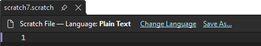
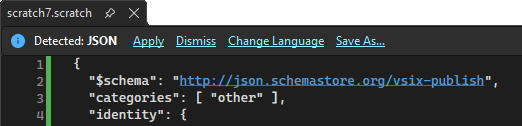
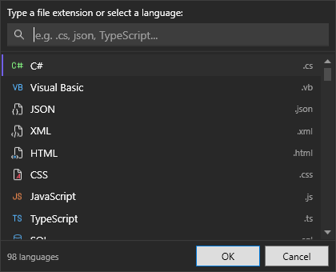
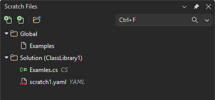
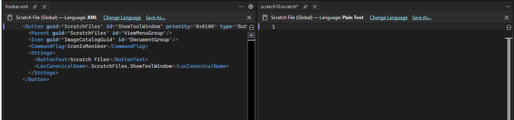

[marketplace]: <https://marketplace.visualstudio.com/items?itemName=MadsKristensen.ScratchFiles>
[vsixgallery]: <http://vsixgallery.com/extension/ScratchFiles.5e5465aa-805e-4395-b20d-a439f7c92ca1/>
[repo]: <https://github.com/madskristensen/ScratchFiles>

# Scratch Files for Visual Studio

Download this extension from the [Visual Studio Marketplace][marketplace] or get the [CI build][vsixgallery].

Instantly create temporary scratch files for quick notes, code snippets, and throwaway experiments — without cluttering your project. Think of it as a notepad that lives inside Visual Studio with full language support.

## Features

### Instant file creation with Ctrl+N

Press **Ctrl+N** to instantly create a new scratch file — no template dialog, no prompts. Just a blank editor ready to go. Files are auto-numbered (`scratch1`, `scratch2`, ...) and stored outside your project.

### Automatic language detection

Start typing and save — Scratch Files detects the language from your content and offers to apply syntax highlighting automatically via the InfoBar.

### Language picker

Click **Change Language** in the InfoBar to choose from every file type registered in Visual Studio. The picker shows a curated list of popular languages at the top and includes all VS-registered content types. You can also type a custom file extension directly.

### Global and solution-scoped files

- **Global scratch files** are stored in `%APPDATA%\ScratchFiles` and available across all sessions.
- **Solution scratch files** are stored in `.vs\ScratchFiles` within your solution directory and travel with the solution.

New files are created in the Global scope by default. Use **Move to Solution** or **Move to Global** in the InfoBar to change the scope of any file.

### Scratch Files tool window

Open via **View > Other Windows > Scratch Files**. The tool window shows all your scratch files organized by scope (Global vs. Solution) with file-type icons, a toolbar for creating new files, and a right-click context menu.

**Drag and drop** files and folders to reorganize them — just like Windows Explorer. Create subfolders via the context menu to keep your scratch files organized.

<!--  -->

### Save As...

Promote any scratch file to a real file. Click **Save As...** in the InfoBar to save a copy to My Documents (or wherever you like). The original scratch file is automatically cleaned up.

### Create scratch file from selection

Select any text in the editor and click the **lightbulb** (or press `Ctrl+.`) to see the **Create scratch file from selection** action. This creates a new scratch file pre-filled with your selection, automatically detecting the language from the source file or content.

<!--! [Lightbulb action for creating scratch from selection](art/suggested-action.png) -->

### Solution Explorer integration

Right-click on the **Solution** node in Solution Explorer to create a new solution-scoped scratch file directly from the context menu.

### Open to the side

Work with scratch files side-by-side with your code using vertical tab groups:

- **Ctrl+Alt+N** — Create a new scratch file and open it in a vertical tab group to the right
- **Alt+Enter** — Open the selected file in the tool window to the side
- **Alt+Double-click** — Double-click a file in the tool window while holding Alt to open it to the side

If a tab group already exists, the file opens in the existing group. If no document is currently open, the file opens normally.

## Keyboard shortcuts

| Action | Shortcut |
|---|---|
| New global scratch file | `Ctrl+N` |
| New scratch file to the side | `Ctrl+Alt+N` |
| Open file (tool window) | `Enter` |
| Open file to the side (tool window) | `Alt+Enter` |
| Rename (tool window) | `F2` |
| Delete (tool window) | `Delete` |

## Options

Go to **Tools > Options > Scratch Files** to configure:

| Setting | Default | Description |
|---|---|---|
| Override Ctrl+N | `true` | Replace the default File > New File template dialog with instant scratch file creation. Requires restart. |

## Contributing

This is a passion project, and contributions are welcome!

- 🐛 **Found a bug?** [Open an issue][repo]
- 💡 **Have an idea?** [Start a discussion][repo]
- 🔧 **Want to contribute?** Pull requests are always welcome

**If this extension saves you time**, consider:

- ⭐ [Rating it on the Marketplace][marketplace]
- 💖 [Sponsoring on GitHub](https://github.com/sponsors/madskristensen)

## License

[Apache 2.0](LICENSE.txt)
